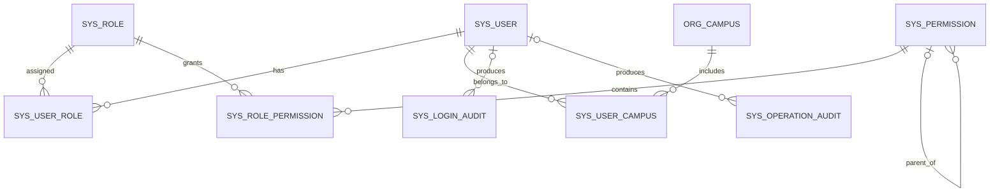

# 数据库基础设计

## 设计边界

- 当前系统服务一个教育机构，不增加 `tenant_id` 或机构租户表。
- 一个用户可以关联多个校区，并可设置一个主校区。
- 权限由角色和权限点组成，角色数据范围固定为 `ALL`、`ASSIGNED_CAMPUSES`、`SELF`。
- 账号、角色、权限和校区通过状态停用，业务代码不应直接物理删除。
- 数据库会话和审计时间统一使用 UTC；校区保留 IANA 时区用于展示和排课换算。

## 核心关系

## 表职责

| 表 | 职责 |
| --- | --- |
| `org_campus` | 校区基本资料、时区、联系方式和启停状态 |
| `sys_user` | 登录身份、安全状态、偏好语言和登录锁定信息 |
| `sys_role` | 系统角色和数据范围策略 |
| `sys_permission` | 可组合的菜单、接口或操作权限点 |
| `sys_user_role` | 用户与角色多对多关系 |
| `sys_role_permission` | 角色与权限点多对多关系 |
| `sys_user_campus` | 用户可访问的校区及主校区标记 |
| `sys_login_audit` | 登录、登出和令牌刷新审计 |
| `sys_operation_audit` | 业务操作、请求结果和资源审计 |

## 数据范围

用户同时拥有多个角色时，服务层按 `ALL > ASSIGNED_CAMPUSES > SELF` 合并数据范围：

- `ALL`：访问所有启用校区的数据。
- `ASSIGNED_CAMPUSES`：只访问 `sys_user_campus` 中已分配的校区。
- `SELF`：只访问当前用户或显式绑定给当前用户的业务主体数据。

权限点只回答“能否执行操作”，数据范围再回答“可以操作哪些记录”，两者必须同时校验。

## 初始化数据

通用迁移初始化 8 个系统角色和 15 个基础权限点。`local` Profile 额外初始化 Richmond、Kingston、Putney、Leicester Square 四个示例校区；生产环境不会执行这部分本地数据。

## 迁移约定

- 版本化迁移位于 `server/src/main/resources/db/migration`，已发布脚本不可修改。
- 本地可重复数据位于 `server/src/main/resources/db/local`，只由 `local` Profile 加载。
- 新字段先允许旧版本服务兼容，再在后续迁移中收紧非空或删除旧字段。
- 所有新增查询都应按实际过滤和排序条件补充索引，并通过 MySQL 8.4 集成测试验证。
